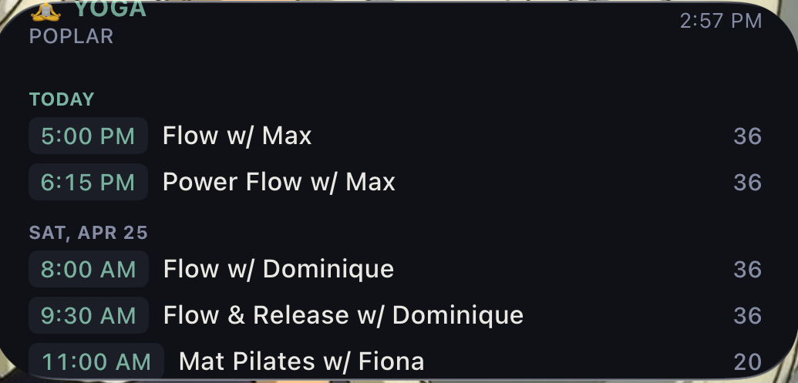

# Seattle-Bouldering-Project-Yoga-Calendar-Widget-Scriptable
This is a custom widget that contains the Current upcoming Yoga events at Seattle Bouldering Project. This script can be pasted to the *Free App* Scriptable allowing you to make this into a customizable widget on your home screen or anywhere running IOS




---

## What It Does

- Shows the next 5 upcoming yoga classes at SBP Poplar
- Displays class name, instructor, start time, and spots remaining
- Color-coded availability — spots turn orange when nearly full
- Groups classes by day with a TODAY label for current day classes
- Tapping the widget opens the SBP booking portal in Safari
- Refreshes automatically every ~15-30 minutes via Scriptable

---

## How It Works

The Bouldering Project's class calendar is hosted by Tilefive which embeds a public0-facing REST API `widgets.api.prod.tilefive.com` that returns class schedule (JSON). This widget makes a request to the API for upcoming classes and injects it into the widget

The API key is a static, public key baked into the BP portal's JavaScript bundle — it is not tied to any user account and can be retrieved from DevTools in about 30 seconds (see setup instructions below).

---

## Requirements

- iPhone running iOS 14 or later
- [Scriptable](https://apps.apple.com/us/app/scriptable/id1405459188) (free on the App Store)

---

## Setup

### 1. Get the API Key

The script requires an API key from the Bouldering Project's web portal:

1. Go to `https://boulderingproject.portal.approach.app/schedule?categoryIds=5`
2. Open DevTools (`Cmd+Option+I` on Mac, or use Safari on iPhone with Web Inspector)
3. Click the **Network** tab and filter by **Fetch/XHR**
4. Select your gym location from the dropdown on the page
5. Look for a request to `widgets.api.prod.tilefive.com/cal`
6. Click it and open the **Headers** tab
7. Under **Request Headers**, copy the value next to `X-Api-Key`

### 2. Install the Script

**Option A — iCloud (recommended)**

1. Save `BPYogaWidget.js` to Scriptable folder in icloud -- it will aut update

**Option B — Manual**

1. Open Scriptable on your iPhone
2. Tap **+** to create a new script
3. Copy the contents of `BPYogaWidget.js` and paste it in

### 3. Add Your API Key

At the top of the script, replace `YOUR_API_KEY_HERE` with the key you copied from DevTools:

```js
const API_KEY = 'YOUR_API_KEY_HERE';
```

### 4. Test It

Tap the **Run** button in Scriptable — a preview of the widget should appear. If you see classes listed, you're good to go.

### 5. Add to Home Screen

1. Long-press your iPhone home screen
2. Tap **+** in the top left
3. Search for **Scriptable**
4. Choose the **Medium** widget size
5. Tap **Add Widget**
6. Long-press the widget → **Edit Widget**
7. Set the Script to `BPYogaWidget`

---

## Configuration

All user-facing settings are at the top of the script:

```js
const LOCATION_ID   = 1;       // 1 = Poplar, 2 = Fremont, 4 = U-District
const LOCATION_NAME = 'Poplar';
const ACTIVITY_ID   = 5;       // 5 = Yoga, 6 = Fitness
const DAYS_AHEAD    = 7;       // how many days ahead to fetch
const MAX_CLASSES   = 5;       // how many classes to show in the widget
```

To show a different location, change `LOCATION_ID` and `LOCATION_NAME`. To show fitness classes instead of yoga, change `ACTIVITY_ID` to `6`.

---

## Project Structure

```
.
├── BPYogaWidget.js   # The Scriptable widget script
└── README.md
```

---

## Notes

- This project is not affiliated with Seattle Bouldering Project or Tilefive
- The API used is publicly accessible from the BP web portal and contains no personal or sensitive data
- If the widget stops working, the API key may have been rotated — follow the setup instructions above to grab the new one from DevTools